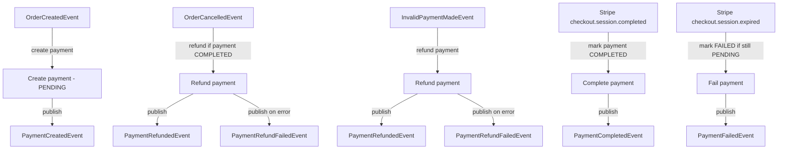

# Payment Service

The Payment Service handles payment processing for the Product Orders platform.
It listens for order events, creates a Stripe Checkout session, and processes Stripe webhooks to confirm or fail
payments.
Once a payment result is known, the service publishes an event to Kafka so the Order Service can update the order
status.

## Responsibilities

- Create and persist payments when orders are created
- Create Stripe checkout sessions for customers
- Handle Stripe webhooks to mark payments completed or failed
- Publish payment events to Kafka
- Refund payments when orders are cancelled or deemed invalid

## Architecture Role

The Payment Service is the platform's payment authority in the event-driven order flow.

- **Consumes order events** from Kafka to create or refund payments
- **Publishes payment events** so the Order Service can update order status
- **Verifies Stripe webhooks** and updates payment state
- **Ensures idempotency** by recording processed order and Stripe events

## Tech Stack

| Technology      | Purpose               |
|-----------------|-----------------------|
| Java 17         | Runtime               |
| Spring Boot     | Application framework |
| Spring Data JPA | Database access       |
| Kafka           | Event messaging       |
| MySQL           | Payment storage       |
| Flyway          | Database migrations   |
| Stripe SDK      | Payment integration   |
| Docker          | Containerization      |

## Environment Variables

An example list of environment variables is found in [`.env.example`](.env.example).

## Running the Service

Run the service using `docker-compose up --build` from [the root directory](../). To run this service in isolation, copy
the payment service and mysql from the root [docker-compose](../docker-compose.yaml) file and run them separately. The
service will be available on port 8088.

## Stripe Integration

Stripe creates a checkout session for each order and redirects the customer to Stripe to complete the payment. Stripe
sends a webhook to the Payment Service when the payment is completed or expired.

### Stripe Webhook

Stripe sends events to POST `/api/payments/stripe/webhook` It handles checkout.session.completed and
checkout.session.expired events.

## API Methods

Base path: `/api/payments`

### 1) Create Stripe checkout session

- **Method:** `POST`
- **Path:** `/api/payments/stripe/checkout`
- **Description:** Creates a Stripe Checkout session and returns the session URL.
- **Response:** `200 OK`

Example request:

{
"orderId": "<order-uuid>",
"items": [
{
"productId": "<product-uuid>",
"quantity": 2,
"name": "Wireless Mouse",
"priceInCents": 2999
}
],
"userEmail": "<customer-email>",
"currency": "USD",
"successUrl": "https://example.com/checkout/success",
"cancelUrl": "https://example.com/checkout/cancel"
}

Example response:

https://checkout.stripe.com/c/pay/cs_test_1234567890

### 2) Stripe webhook

- **Method:** `POST`
- **Path:** `/api/payments/stripe/webhook`
- **Description:** Receives Stripe webhook events to complete or fail payments.
- **Required header:** `Stripe-Signature`
- **Response:** `200 OK`

## Database Schema

#### `payment`

- `payment_id` `binary(16)` -- **PK**
- `order_id` `binary(16)` -- not null, **unique**
- `currency_code` `varchar(3)` -- not null
- `amount_cents` `bigint(20)` -- not null
- `payment_status` `enum('COMPLETED','FAILED','PENDING','REFUNDED')` -- not null
- `created_at` `datetime(6)` -- not null
- `updated_at` `datetime(6)` -- nullable
- `version` `bigint(20)` -- nullable (optimistic locking/versioning)

#### `processed_order_service_event`

- `id` `bigint(20)` -- **PK**, auto increment
- `event_id` `binary(16)` -- unique (`uk-processed_order_service_event-eid`)
- `processed_at` `datetime(6)` -- not null

#### `processed_stripe_event`

- `id` `bigint(20)` -- **PK**, auto increment
- `event_id` `varchar(255)` -- unique (`uk-processed_stripe_event-eid`)
- `processed_at` `datetime(6)` -- not null

## Notes on security

Protected endpoints expect a JWT:

- `Authorization: Bearer <token>`

The JWT signature is verified using the Auth Service's JWKS endpoint. Stripe webhooks are verified using the configured
webhook secret.
